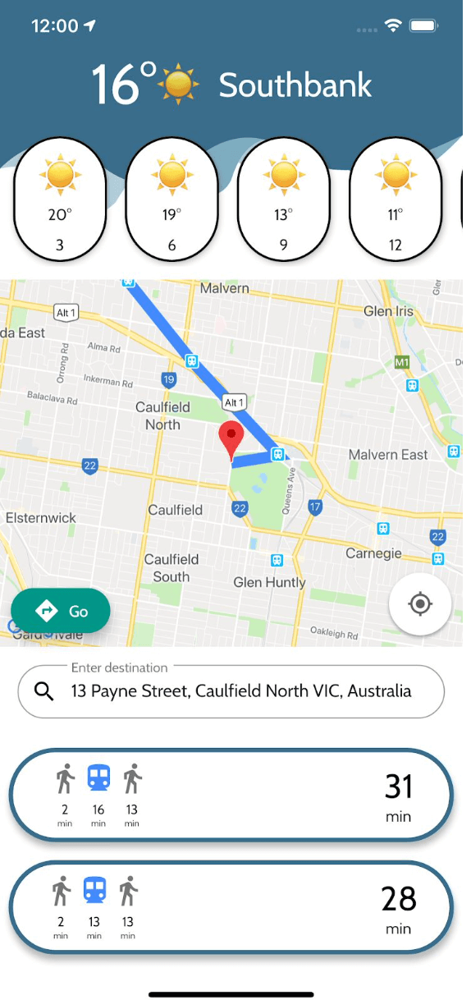

# GET ME THERE

A Flutter application that have weather and public transport info

## Getting Started

Clone the repository in your desired folder
 
``flutter pub get``
 
to install dependencies listed in pubspec.yaml
 
If running in local start server that will be called from the app.

## NOTE
This project uses a microservice to protect customer information. 
You will need your own API KEYS for OpenWeatherMaps and HERE. 

<h1 align="center">
  
</h1>
